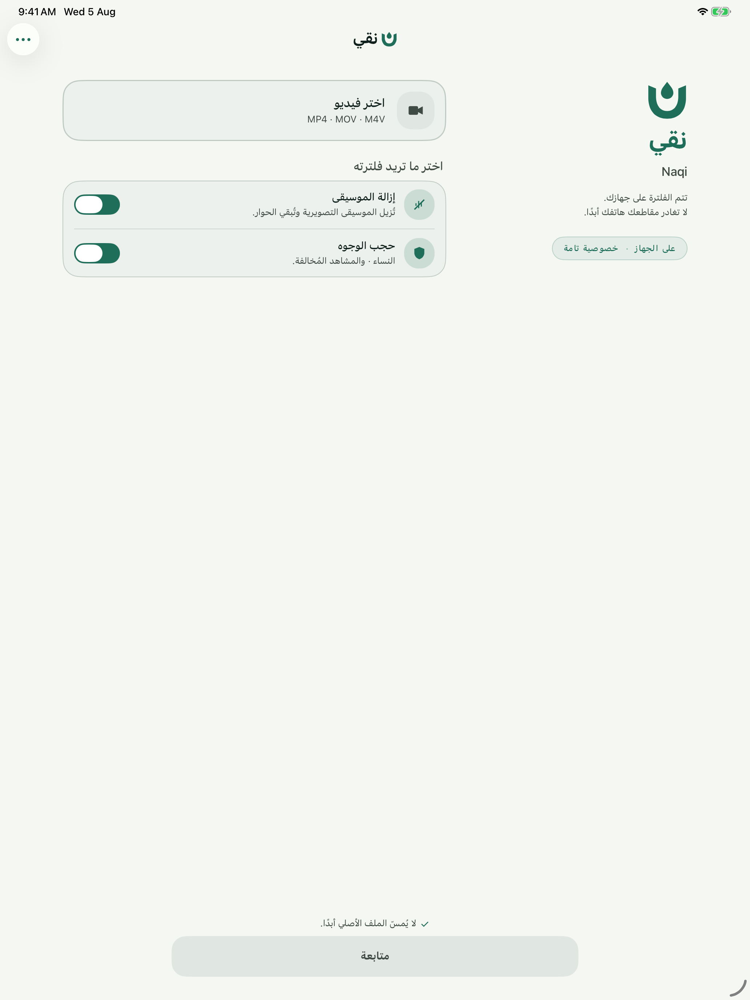
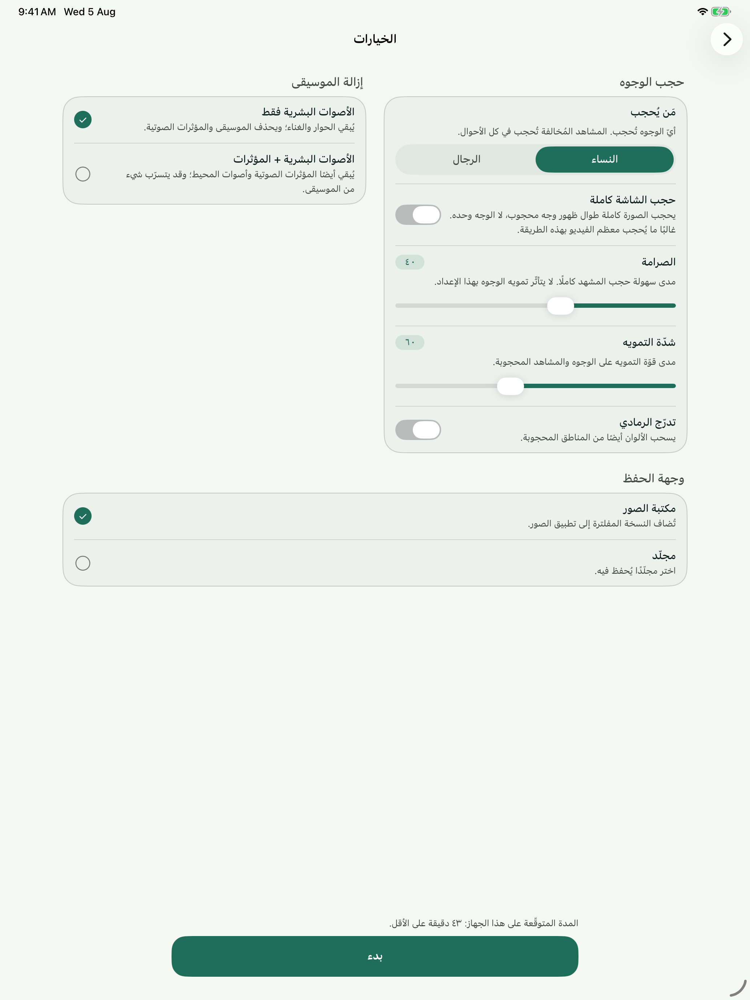
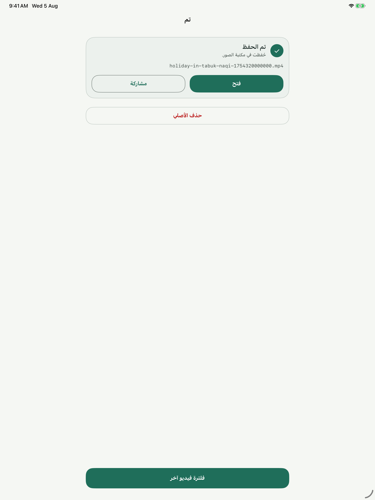

# نقي | Naqi

[العربية](README.ar.md) · [English](README.md)

نقي يفلتر الفيديو على آيفون وآيباد وماك. يمكنك إزالة الموسيقى مع الإبقاء على الكلام، وتغطية الوجوه والمشاهد المصنّفة، ثم حفظ النتيجة في ملف جديد. تتم معالجة الملفات المحلية على جهازك، ويبقى الملف الأصلي دون تغيير.

<p align="center">
  
  
  
</p>

## ما الذي يمكنك فعله؟

- استيراد فيديو من الصور أو الملفات، أو مشاركته إلى نقي. ويمكنك سحب ملف إلى التطبيق على ماك. تدعم الملفات الصوتية إزالة الموسيقى.
- إزالة الموسيقى أو تغطية الوجوه وضبط درجة الحذر في تغطية المشاهد المصنّفة. يمكنك استخدام إحدى العمليتين أو كلتيهما.
- حفظ نسخة مفلترة في الصور أو مجلد تختاره، واستئناف العمل بعد انقطاعه.
- استخدام التطبيق بالعربية مع تخطيط من اليمين إلى اليسار، أو بالإنجليزية.

يقبل نقي الملفات التي يستطيع نظام Apple قراءتها، ومنها صيغ الفيديو الشائعة MP4 وMOV وM4V. لا يدعم حاويات MKV وWebM. قد تفوت الفلترة وجهًا أو مشهدًا، لذا راجع النتيجة قبل مشاركتها.

## البناء من المصدر

تحتاج إلى جهاز ماك عليه Xcode وحزم تطوير iOS 18 وmacOS 15. يستخدم المشروع Swift 6 ويجلب ONNX Runtime عبر Swift Package Manager.

1. احصل على ملفات النماذج من [مشروع نقي لأندرويد](https://github.com/haithamassoli/NaqiHalalVideoFilter). اضبط `NAQI_ANDROID_REPO` على مسار نسختك المحلية، ثم ثبّت حزم Python اللازمة لإعداد نماذج Apple:

   ```sh
   python3 -m pip install numpy onnx onnxruntime
   NAQI_ANDROID_REPO=/path/to/NaqiHalalVideoFilter ./scripts/fetch-models.sh
   ```

2. ضع ملفات خط Thmanyah Sans المرخّصة بأوزان `Regular` و`Medium` و`Bold` في `NaqiShared/Fonts/`، بالأسماء `thmanyahsans-Regular.otf` و`thmanyahsans-Medium.otf` و`thmanyahsans-Bold.otf`.
3. افتح `naqi.xcodeproj`، واختر مخطط `naqi`، ثم شغّل التطبيق على محاكي iOS أو جهاز ماك. للبناء من الطرفية لمحاكي iOS:

   ```sh
   xcodebuild -project naqi.xcodeproj -scheme naqi -destination 'generic/platform=iOS Simulator' -derivedDataPath build.noindex/README CODE_SIGNING_ALLOWED=NO build
   ```

ملفات النماذج والخط مستثناة من Git. راجع شروطها قبل الحصول عليها أو توزيعها؛ التفاصيل في [إشعارات الأطراف الثالثة](NOTICE).

## الخصوصية والاتصال بالشبكة

يعالج نقي الملفات المستوردة محليًا. إذا استخدمت رابطًا لجلب فيديو، يتصل التطبيق بالمصدر لتنزيله قبل الفلترة. لا تتطلب معالجة الملفات المحلية حسابًا أو رفعًا. تجد بيان الخصوصية في شاشة «حول التطبيق».

## الترخيص

تخضع الشيفرة التي كتبها مطوّر نقي [للترخيص](LICENSE) الذي يسمح **بالاستخدام الشخصي غير التجاري**. تخضع شيفرات الأطراف الثالثة والخطوط وأوزان النماذج لشروط مستقلة موضّحة في [NOTICE](NOTICE).
