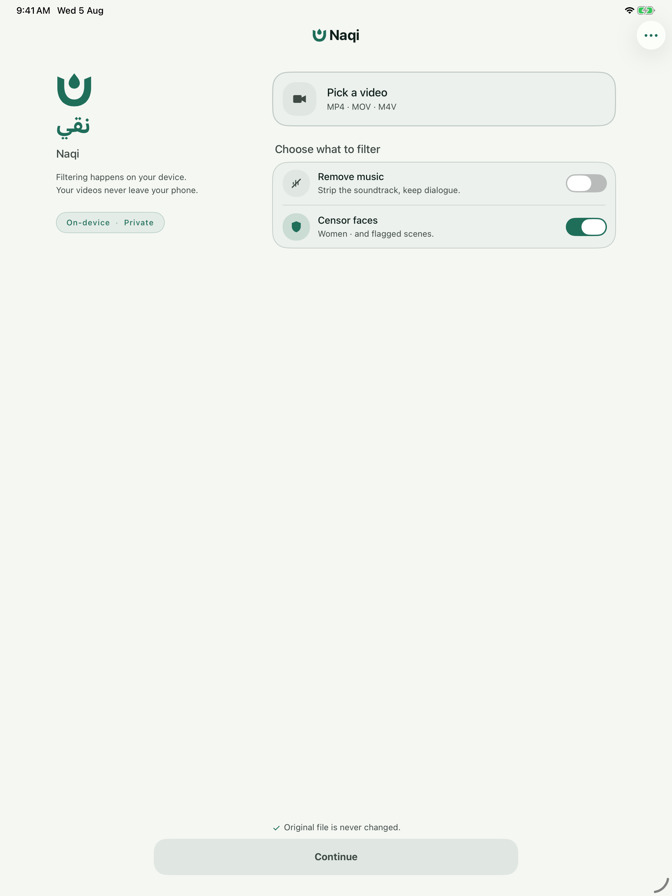
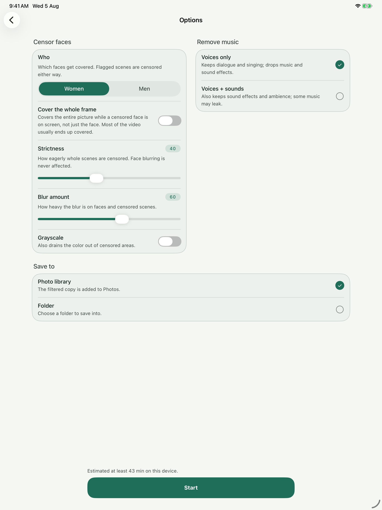
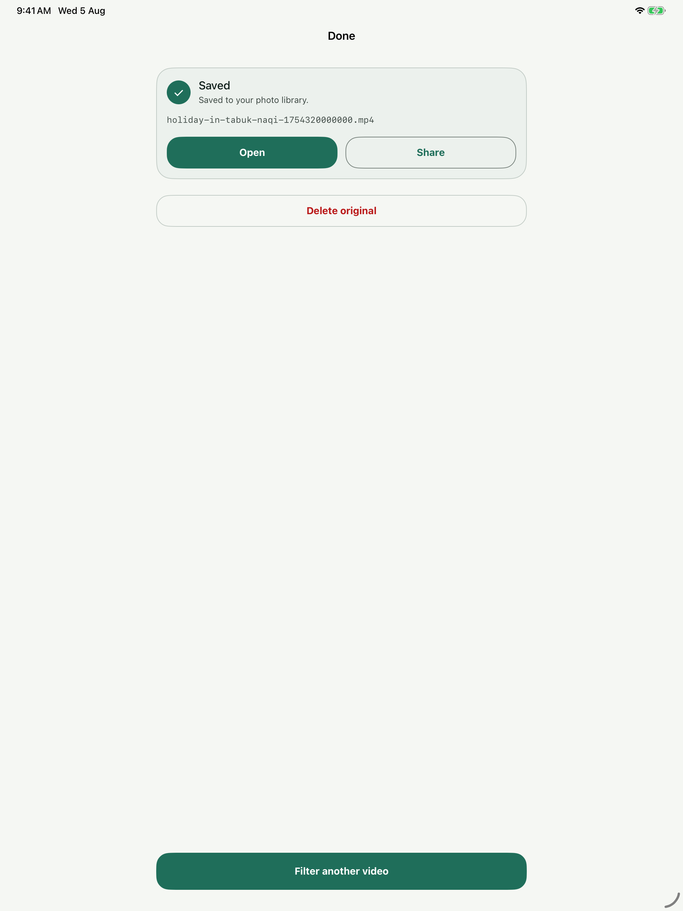

# Naqi | نقي

[English](README.md) · [العربية](README.ar.md)

Naqi filters video on iPhone, iPad, and Mac. It can remove music while keeping speech, cover selected faces and flagged scenes, and save the result as a new file. Processing of local media runs on the device; the original file stays untouched.

<p align="center">
  
  
  
</p>

## What you can do

- Import a video from Photos or Files, or share one to Naqi. On Mac, you can also drag in a file. Audio files support music removal.
- Remove music, cover faces, and adjust how cautiously Naqi covers flagged scenes. Run either filter alone or both together.
- Save a filtered copy to Photos or a folder. Interrupted jobs can resume from saved progress.
- Use the app in English or Arabic, with right-to-left layout for Arabic.

Naqi accepts media that Apple's system decoders can read, including common MP4, MOV, and M4V videos. It does not support MKV or WebM containers. Filtering can miss a face or scene, so review the result before sharing it.

## Build from source

You need a Mac with Xcode and the iOS 18 / macOS 15 SDKs. The Xcode project uses Swift 6 and resolves ONNX Runtime through Swift Package Manager.

1. Obtain the model assets from the [Android Naqi project](https://github.com/haithamassoli/NaqiHalalVideoFilter). Set `NAQI_ANDROID_REPO` to its checkout path, then install the Python packages used to prepare the Apple models:

   ```sh
   python3 -m pip install numpy onnx onnxruntime
   NAQI_ANDROID_REPO=/path/to/NaqiHalalVideoFilter ./scripts/fetch-models.sh
   ```

2. Put licensed Thmanyah Sans `Regular`, `Medium`, and `Bold` `.otf` files in `NaqiShared/Fonts/`, named `thmanyahsans-Regular.otf`, `thmanyahsans-Medium.otf`, and `thmanyahsans-Bold.otf`.
3. Open `naqi.xcodeproj`, select the `naqi` scheme, and run it on an iOS simulator or a Mac. For an iOS simulator build from the terminal:

   ```sh
   xcodebuild -project naqi.xcodeproj -scheme naqi -destination 'generic/platform=iOS Simulator' -derivedDataPath build.noindex/README CODE_SIGNING_ALLOWED=NO build
   ```

The models and font files are excluded from Git. Check their terms before obtaining or distributing them; see [third-party notices](NOTICE).

## Privacy and network use

Naqi processes imported files locally. If you use a link to fetch media, the app connects to that source to download it before filtering. Local processing does not require an account or an upload. The app's About screen contains its privacy statement.

## License

The Naqi-authored code is available for **personal, non-commercial use** under [LICENSE](LICENSE). Third-party code, fonts, and model weights have separate terms in [NOTICE](NOTICE).
