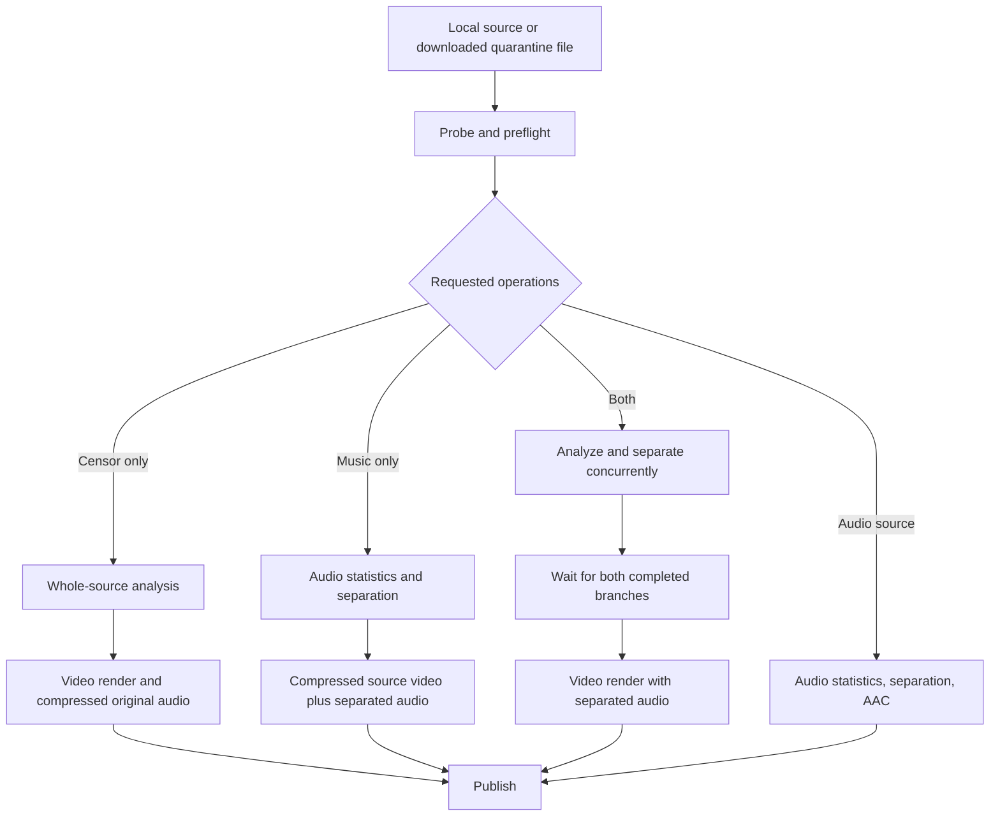

# Naqi: Apple Silicon performance improvement plan

Date: 2026-09-22  
Code reviewed: working tree based on `4d4a9ae`  
Scope: downloading, video analysis and blur, music removal, and the job lifecycle connecting them.

Implementation update, 2026-09-22: the code now includes the Current/Fast product modes, 720-short-side Fast rendering and remote selection, lazy Demucs startup and shared cleanup, bounded concurrent downloads with byte progress and resume data, completed-download identity/reuse, corrected stream/mux semantics, empty-EDL passthrough, reusable segmented render context, reusable NSFW input storage, earlier stage checkpoints, corrected scratch accounting, cancellable remuxing, and expanded timing/provider logs. Simulator correctness tests and native Mac compilation validate those changes; simulator results are not hardware-performance claims.

The native Core ML replacement, custom GPU kernels, continued-processing GPU entitlement path, alternate Fast presets, thermal/thread policies, and new render/audio overlap remain measurement-gated experiments. They require the physical iPhone/iPad/Mac matrix and, for continued GPU work, the Apple entitlement described below. No new model artifact was added.

## 1. Objective and confirmed priorities

Minimize the time from pressing Start to a playable, saved result across all supported Apple devices with equal priority. Optimize sustained performance and memory use on iPhone, iPad and Mac, and provide an explicit lighter-quality option for users who want the fastest result. Preserve source integrity, synchronization and the requested censoring/music-removal behavior in both quality modes.

The user confirmed these product priorities:

- Give all supported Apple devices equal priority. Validate iPhone, iPad and native Mac in each release phase; choose device-specific execution policies from measurements rather than forcing identical thread counts or providers. Exact physical test devices still need selection.
- Target maximum speed, with a lighter-quality mode selected by the user. Deliver this mode as planned product work, alongside optimizations that preserve the current quality. Section 5.1 defines its initial scope and acceptance rules.

Retain these implementation constraints:
- Keep processing on device. No server processing or new runtime dependency is required for the initial phases.
- Retain the current deployment floors: iOS 18 and macOS 15. Gate newer APIs by availability and actual device capability.
- Keep one processing job active by default. Use concurrency inside that job where measurements justify it.

The current project uses Swift 6 language mode, nonisolated default isolation, Approachable Concurrency, and ONNX Runtime 1.24.2. Recheck effective build settings before changing task isolation. The existing local change to `naqi.xcodeproj/project.pbxproj` was left untouched.

The order of work is: establish trustworthy measurements, remove unnecessary work, deliver the explicit lighter-quality mode, improve use of the existing Apple frameworks, and then evaluate new model artifacts or custom GPU code. Evaluate benefits separately for each supported device class and quality mode.

## 2. How the application works today

### 2.1 Downloading

Relevant files: [Downloader.swift](../../naqi/Download/Downloader.swift), [NativeExtract.swift](../../naqi/Download/NativeExtract.swift), [YtDlp.swift](../../naqi/Download/YtDlp.swift), [MediaFormat.swift](../../naqi/Download/MediaFormat.swift), [MediaMux.swift](../../naqi/Download/MediaMux.swift), and [DownloadQuality.swift](../../NaqiShared/DownloadQuality.swift).

1. A remote job reaches `JobRunner.run`, which calls `Downloader.download` before media probing and processing.
2. On macOS, extraction attempts the managed `yt-dlp_macos` executable, then falls back to `NativeExtract`. Some comments still describe a Python zipapp, but the implementation downloads the standalone executable. iOS uses native extraction.
3. Native extraction handles direct media URLs, YouTube player responses, and media URLs found in page metadata or HTML. The actual transfer path downloads individual files; it is not a general HLS/DASH manifest downloader.
4. `DownloadQuality.select` picks one or two formats, preferring MP4/M4A compatibility. Its comment says combined streams win, but its implementation first returns a selected video plus a separate audio format when their IDs differ.
5. `URLSession.shared.download(for:)` writes each transfer to a temporary file. For two formats, the app downloads video and then audio, then performs a passthrough merge.
6. Completed files remain in `Application Support/naqi-downloads/<URL hash>/` until the job publishes its result. A seven-day sweep clears old directories.

Current limitations visible in the code:

- Transfer progress changes at file boundaries, using fixed 70/20/10 percent allocations for video/audio/merge, rather than measured bytes.
- An extensionless media endpoint can be read in full by `NativeExtract.pageExtract` through `data(for:)`, identified by its MIME type, and then downloaded again by `Downloader.fetch`.
- Stable quarantine directory names do not implement resume: there is no persisted transfer ledger or use of completed files before fetching again.
- A filtering interruption still reaches the deferred `Downloader.discard`, so a resumed remote job may download the source again before using its processing checkpoints.
- A merge failure returns the selected video file as success. With a video-only format, this can silently lose audio; with a combined format, it can retain audio other than the requested selection.
- The in-app paste UI is date-gated until 2026-10-12 in [LinkPaste.swift](../../naqi/UI/LinkPaste.swift); share-to-download still reaches the backend. Benchmarks must exercise the backend or share route without changing that product decision.

### 2.2 Video analysis and blur

Relevant files: [AnalyzePass.swift](../../naqi/Analyze/AnalyzePass.swift), [FrameSampler.swift](../../naqi/Analyze/FrameSampler.swift), [FaceTracker.swift](../../naqi/Analyze/FaceTracker.swift), [GenderVote.swift](../../naqi/Analyze/GenderVote.swift), [Edl.swift](../../naqi/Analyze/Edl.swift), [RenderPass.swift](../../naqi/Render/RenderPass.swift), and [CensorEffect.swift](../../naqi/Render/CensorEffect.swift).

The censor operation has two passes:

1. **Analyze the complete source.** `AVAssetReader` decodes sequentially. The sampler emits approximately 10 frames per source second; it still decodes intervening frames. It scales the detector image to a 640-pixel maximum dimension using vImage on the Y and CbCr planes.
2. **Detect and classify.** Vision detects faces. The optional NSFW model runs at approximately 5 fps on a 224×224 tensor gathered from the original source planes. Detection overlaps NSFW inference, and the producer prepares one frame ahead. Face tracking associates boxes and takes up to five qualifying gender votes per track. Choosing Everyone skips gender model loading and voting.
3. **Finalize the edit decision list, or EDL.** It contains whole-frame censor intervals and face tracks with interpolated rectangles. Pre/post-roll, tracking lifetime, interval bridging, and whole-frame promotion affect coverage.
4. **Render the source again at its original frame rate.** `RenderPass` looks up the EDL at each source timestamp, applies the effect where needed, and feeds `AVAssetWriter`. Original audio passes through compressed unless a separated track replaces it.

The effect already uses a Metal-backed `CIContext`, IOSurface-backed pixel buffers, and built-in Core Image filters. It scales down before Gaussian blur, forces a low-resolution intermediate, and scales back up. Region masks feather outward from the hard rectangle; whole-frame censorship bypasses region compositing. Solid fill already exists and skips blur.

Uncensored SDR frames skip Core Image, but still pass through the video encoder. There is currently no whole-file compressed-video fast path for a successfully finalized empty EDL. HDR input takes the tone-map path on every frame and exports SDR, so it cannot use an SDR no-effect shortcut unchanged.

### 2.3 Music removal

Relevant files: [AudioPipeline.swift](../../naqi/Audio/AudioPipeline.swift), [AudioDecode.swift](../../naqi/Audio/AudioDecode.swift), [MusicGate.swift](../../naqi/Audio/MusicGate.swift), [Demucs.swift](../../naqi/Audio/Demucs.swift), [STFT.swift](../../naqi/Audio/STFT.swift), [Models.swift](../../naqi/ML/Models.swift), and [Ort.swift](../../naqi/ML/Ort.swift).

1. `AudioStats.measure` estimates normalization values. It decodes the complete track up to 80 seconds; for longer sources it reads twenty two-second windows distributed across the duration.
2. `AudioDecoder` streams 44.1 kHz float audio and folds multichannel content into stereo with explicit center/surround coefficients.
3. YAMNet scores music on mono 16 kHz audio. It uses a 0.15 threshold, a silence shortcut, and a two-tier ±2-chunk dilation policy. Failure to open the gate means separating every chunk; an inference error during scoring currently propagates.
4. Demucs processes fixed 114,660-sample windows, or 2.6 seconds, with a 103,194-sample stride, or 2.34 seconds. The overlap and lookahead keep memory bounded.
5. Accelerate/vDSP performs the STFT and inverse STFT. The FFT uses Double precision to preserve existing numerical tests. The model receives waveform and spectrogram inputs.
6. ORT runs `htdemucs_s26_f32` through Core ML with `CPUAndGPU` and `MLProgram`, with a CPU fallback. The app keeps vocals, or vocals plus the other stem. Drums and bass are excluded.
7. The separator sums selected stems before a single inverse STFT, performs overlap-add and clipping, and streams PCM into AAC encoding. Music-free chunks skip Demucs inference but still follow the reconstruction and AAC output path.

Input tensors and DSP scratch already persist across chunks. The app reads model output through ORT-owned buffers rather than copying all stems into Swift arrays. The ring sizes are bounded; increasing media duration does not require storing the whole PCM track.

Music removal is stem separation, not guaranteed speech-only extraction: singing can remain in vocals, and some musical content can remain in the other stem. Performance work must not silently redefine the selected stems.

### 2.4 Job scheduling and the actual critical path

Relevant files: [JobRunner.swift](../../naqi/Jobs/JobRunner.swift), [JobQueue.swift](../../naqi/Jobs/JobQueue.swift), [Checkpoint.swift](../../naqi/Jobs/Checkpoint.swift), and [Remux.swift](../../naqi/Media/Remux.swift).



For local, unsegmented jobs, approximate wall time is:

| Shape | Current stage relationship |
|---|---|
| Censor only | analyze + render + publish |
| Music only | audio preparation/separation + compressed-video mux + publish |
| Both operations | max(analyze, audio preparation/separation), with contention, + render + publish |
| Audio only | audio preparation/separation + publish |

Remote jobs add extraction, transfers, and any download merge before these stages. Loading and compiling models must also be included wherever they occur.

For censor jobs at least 30 minutes long, the runner renders five-minute video segments sequentially, concatenates them, and attaches one continuous audio track. Analysis still runs across the complete source. Completed EDLs, audio tracks, and video segments act as checkpoints; partial audio separation is not currently checkpointed.

`bothBranches` overlaps **analysis and separation**, not rendering and separation. Current task priorities express preferences, but do not pin analysis to efficiency cores or reserve performance cores for audio. The writer pump also uses a separately created dispatch queue, so parent task priority alone does not prove the intended scheduling behavior.

## 3. Existing acceleration to preserve

| Work | Current implementation | Improvement direction |
|---|---|---|
| Video decode/encode | AVFoundation reader/writer, H.264 or HEVC settings | Verify actual acceleration, format support, and encoder waits on each device |
| Blur and masks | Metal-backed Core Image, reduced-resolution Gaussian, IOSurface buffers | Remove setup costs and measured synchronization gaps before replacing filters |
| Face detection | Vision with default compute selection and CPU fallback | Profile device placement and request latency |
| NSFW model | Static batch 1, Core ML NeuralNetwork, `ALL` | Verify placement and performance across device classes, especially during separation |
| Demucs | Core ML MLProgram, `CPUAndGPU`, fixed shapes, fp32 graph | Reduce cold-start and unnecessary loading; then inspect expensive partitions |
| Gender and music gate | XNNPACK, four worker threads | Measure smaller thread counts under real concurrent workloads |
| Audio transforms/downmix | Accelerate/vDSP with reused storage | Optimize only measured dominant loops; preserve numerical contracts |
| Memory control | Demucs CPU arena/memory-pattern disabling, bounded rings, writer backpressure | Close lifecycle gaps and measure loading-time peaks |
| Core ML disk cache | SHA-256 directory in Application Support, excluded from backup | Add lifecycle/invalidation policy and separate disk-cache warmth from session warmth |

Core ML configuration makes compute devices eligible; a successful Core ML session does not establish which device executed each operation. Use provider partition diagnostics and compute-plan information together with runtime traces. ORT documents `ProfileComputePlan` and the compute-unit options in its [Core ML execution provider reference](https://onnxruntime.ai/docs/execution-providers/CoreML-ExecutionProvider.html).

Unified memory helps frameworks share storage, but tensor copies, pixel conversion, allocation, and synchronization still cost time. The goal is a shorter critical path within memory and thermal limits, not maximum utilization of every processor at once.

## 4. Evidence and measurement gaps

### Existing results are historical baselines

| Checked-in evidence | Recorded result | How this plan uses it |
|---|---|---|
| [M7 results](m7-perf-results.md) | Mac censor test: 643-second 1080p clip, 45.0 s analyze, 91.1 s render, 136.1 s total, 234 MB peak | A reference workload; remeasure current code and record exact Mac model |
| [Inference specification](spec-inference-apple.md) | M3, ORT 1.24.2: fp32 Demucs Core ML GPU inference 160.2 ms/chunk; fp16 variant 128.8 ms/chunk | Keep model precision and host attached to every number; the advertised 4.31× figure belongs to the fp16 comparison |
| [Inference specification](spec-inference-apple.md) | Core ML setup measured in tens of seconds; fp32 compiled cache roughly 615 MB | Prioritize first-use latency and cache management |
| [M7 results](m7-perf-results.md) | An earlier separation memory configuration improved to 1115 MB after disabling the arena/pattern planner | Preserve the fix, but measure the current production Core ML path independently |
| [BenchTests.swift](../../naqiTests/BenchTests.swift) | Existing provider, footprint, thread-sweep, end-to-end and long-soak checks | Extend this harness rather than creating a second benchmark system |

These figures were not rerun for this plan. Mac, simulator, Android, and physical iPhone results are different populations. A Mac result is neither a guaranteed upper bound nor a prediction for a phone. Do not infer an encoder bottleneck solely from similar total render times or a small Debug/Release difference; capture a trace.

The [August improvement plan](improvement-plan-2026-08.md) contains completed items: Core ML provider wiring, static model shapes, YAMNet, gender-vote skipping, solid fill, and scheduled background resume now exist. This plan does not count implementing them again as new gains.

### Missing measurements to add first

- `JobRunner` starts its job clock after downloading and preflight, and download-only completion returns `wallMs = 0`.
- `AnalyzePass.wallMs` starts after model loading, detector resolution, and sampler setup.
- `AudioPipeline.Result.separateMs` excludes normalization and model construction; its stage speed is not full audio-job speed.
- `BenchTests.demucsProviders` reports the requested provider and tests finite waveform output, but can hide a CPU fallback and does not establish spectral quality on real audio.
- Several benchmarks use minimum-of-N. This helps diagnose contention but does not describe typical latency or sustained phone performance.
- `MemoryFootprint` records sampled values, not a guaranteed instantaneous high-water mark. End-of-chunk samples can miss model compilation and inference peaks.

## 5. Prioritized work

Effort is relative: S = a narrow change and regression test, M = several connected changes, L = an experiment or new artifact requiring broader validation. Impact describes the opportunity, not a promised speedup.

| ID | Priority | Change | Expected opportunity | Effort |
|---|---|---|---|---|
| M1 | P0 | Measure complete jobs, actual providers, waits, memory and thermals | Establish what limits each workload | M |
| Q1 | P1 | Deliver an explicit Fast / lighter-quality mode | Reduce transfer bytes and rendered pixels with user-selected tradeoffs | M |
| A1 | P1 | Load Demucs only when a chunk requires separation | Avoid its load/compile on gate-negative content | S–M |
| A2 | P1 | Make Demucs cleanup cover audio-only and all exit paths | Remove retained model memory between jobs | S |
| D1 | P1 | Avoid extensionless-media double download and unbounded page reads | Save one body transfer and its RAM allocation | M |
| D2 | P1 | Correct format selection/merge success semantics | Avoid needless streams/muxing and missing audio | M |
| D3 | P1 | Two bounded concurrent transfers, real progress, cancellation | Overlap independent network work | M |
| J1 | P1 | Preserve reusable remote inputs with validated checkpoint identity | Avoid re-downloading and invalid resume reuse | M |
| V1 | P1 | Whole-file no-effect video passthrough after final analysis | Eliminate decode/encode for eligible jobs | M |
| A3 | P2 | Improve model-cache and session startup behavior | Reduce short-job latency and repeated setup | M |
| V2 | P2 | Reuse render context across segments; reduce tensor churn | Remove repeated setup and allocations | S–M |
| H1 | P2 | Measure codec acceleration, threads and branch scheduling | Improve sustained hardware use | M |
| J2 | P2 | Preserve more completed work; correct disk accounting | Reduce interruption cost and false space failures | M |
| B1 | P2 | Capability-gated continued background processing | Improve completion when users leave the app | M |
| X1 | P3 | Native Core ML Demucs conversion experiment | Reduce startup/partition overhead if it remains material | L |
| X2 | P3 | Targeted GPU preprocessing, mask or render-pipeline experiment | Address a demonstrated CPU/GPU bottleneck | M–L |
| X3 | P3 | Render/audio overlap, then restricted streaming-analysis research | Shorten a proven serial portion | L |

### 5.1 Q1: Current quality and Fast modes

Offer two clear choices before starting a job:

| Mode | User-facing behavior | Engineering contract |
|---|---|---|
| Current quality | Preserve current resolution, timing and processing quality | Apply the quality-preserving optimizations in this plan |
| Fast / lighter quality | Finish sooner using a smaller video output; explain the chosen resolution and any other quality reduction | Use a measured preset with separate quality and performance validation |

Keep existing jobs and saved options on Current quality until the user explicitly selects Fast. Remember that choice for later jobs and show it in the start/share flow. Do not silently change a running or resumed job's quality because the device gets hot.

**Initial Fast preset to benchmark:** cap video output at a 720-pixel short side, preserve aspect ratio and even dimensions, never upscale, and preserve source presentation timestamps and frame rate. This is a proposed starting point, not a measured optimum. Test 480p, 720p and 1080p alternatives and select the least costly preset that meets the declared visual-quality floor. Express portrait output dimensions correctly rather than treating a height cap as equivalent to a short-side cap.

For local sources, analyze the original file with the current detection cadence and model inputs, then render directly at the selected output size. This reduces render/encode work without weakening detection. Adjust `BlurPlan`, normalized-region mapping, pixel-buffer pools, writer dimensions, bitrate and HDR handling together so the effect has the same relative strength and region coverage at the new size. Reuse the current resolution-dependent bitrate policy as the starting point; a lower bitrate alone is not proof of faster encoding.

For remote sources, select a smaller compatible stream before transferring when Fast requests it. Make the resulting output resolution visible to the user. Since downloading a smaller source also changes the pixels available to analysis, compare detection coverage against the higher-quality source on the labeled corpus. Do not describe this path as EDL-identical. Keep download quality and processing quality consistent, and avoid fetching an unnecessarily large stream just to downscale it later.

Preserve the user's chosen censor target, scene filtering, blur/fill choice and kept audio stems in both modes. Fast must not switch to solid fill, turn off scene detection, skip uncertain music, or lower blur strength without an explicit corresponding user choice. Keep the existing audio separator initially: smaller video dimensions do not accelerate an audio-only job. Label that limitation accurately, and use lazy loading, provider selection and cache improvements to accelerate audio jobs in both modes.

After the initial preset, evaluate these additional tradeoffs independently if their measured benefit warrants inclusion in Fast:

- An output frame-rate cap for high-frame-rate sources, using source timestamps and unchanged full-rate analysis. Validate VFR timing, audio synchronization and coverage on retained frames.
- A smaller or mixed-precision audio separator, preserving selected-stem semantics and a declared floor for speech intelligibility and music suppression. This needs real-audio quality comparison; lower AAC bitrate alone does not remove the dominant separation cost.
- Lower analysis cadence or detector dimensions only with explicit quality characterization and a predeclared coverage floor. Do not bundle this risk into the first resolution-only preset.

Before implementation, define the preset values and quality tolerances using representative output comparisons. Add the selected mode, resolved preset version, output geometry, frame-rate policy and any model variant to persisted job options and checkpoint identity. Supply backward-compatible defaults and cover queue storage, share handoff, resume and English/Arabic labels.

Acceptance: the user can select the mode before Start; existing jobs retain their behavior; both modes pass integrity, timing and cancellation checks; and Fast demonstrates a material full-job gain on eligible workloads. Use a proposed target of at least 20% lower median completion time for high-resolution render-bound clips, reporting results separately for each device class. This is a decision threshold, not a promise. For already-small clips or audio-only jobs, report the measured benefit honestly and avoid needless re-encoding merely to apply a preset. Do not let an average across devices hide a regression on one platform.

## 6. Download implementation plan

### D1. Inspect headers without buffering the complete media body

Change `NativeExtract.pageExtract` to distinguish HTML from media using response headers before consuming a large body. Start with a header request where the server supports it, and a bounded streaming GET fallback where it does not. Close the probe when it identifies media. Bound HTML bytes and check HTTP status before parsing.

Do not issue an unconditional full `data(for:)` request for an unknown endpoint. Keep redirect handling, authentication headers, content type, and final URL consistent between inspection and transfer. A server may ignore Range or HEAD, so neither is a sufficient size guard alone.

Acceptance: a controlled extensionless 100 MB media endpoint is not loaded into a 100 MB `Data` value and does not transfer two complete bodies. Include HEAD refusal, ignored Range, redirects, missing length, and oversized HTML in the same focused fixture set.

### D2. Pick streams according to the requested result

Resolve the mismatch between `DownloadQuality.select` and its comment. Prefer a compatible combined stream when it satisfies the same requested quality; retain separate higher-quality video/audio when the combined stream would reduce quality. Compare resolution, codec compatibility and bitrate deliberately, rather than treating filename extension as proof of decodability.

Do not report a successful audio/video download when the merge failed. Preserve the selected files for a controlled retry, or return an explicit failure. Verify both tracks, duration, rotation, and timing before promotion from temporary state.

`MediaMux.merge` currently ignores the loaded audio range, inserts an audio range based on video duration, and does not carry the video's preferred transform. Reuse the existing remux code only after defining how to preserve track start offsets and unequal lengths. `Remux.mux` also inserts its loaded ranges at zero, so replacing one call with the other does not by itself prove synchronization.

Acceptance: equivalent combined streams skip the merge; separate streams retain the selected quality; shorter audio, portrait video, nonzero starts and a failed merge cannot produce silent success or shifted content.

### D3. Use bounded network concurrency and real transfer state

Fetch the selected video and audio concurrently with a limit of two transfers per job. Keep processing jobs serial initially. Measure against sequential transfer: the network/CDN may already saturate with one stream, so the expected time approaches `max(video, audio)` only when bandwidth and server behavior allow it.

Use `URLSessionDownloadTask` delegate progress, aggregate actual bytes, and represent unknown content length without inventing a percentage. Throttle user-facing progress by wall clock, for example to 2–4 updates per second, while reporting stage boundaries immediately.

Propagate user cancellation and lifecycle interruption to active URLSession tasks and macOS extractor processes. Preserve the distinction between cancellation, interruption, and failure. Current Swift task cancellation can cancel an awaited download; the separately polled lifecycle flag is not enough to interrupt every blocked operation.

For macOS extraction, drain stdout and stderr while the process runs. `runProcess` currently reads both only in `terminationHandler`; a large JSON dump can fill a pipe before process termination. Add a bounded timeout and terminate the owned subprocess on cancellation. Keep retry/update behavior bounded and reuse completed transfers when only one stream failed.

Acceptance: a deterministic HTTP test observes at most two active transfers, monotonic byte accounting, prompt cancellation, correct unknown-length handling, and no output promotion before all required tracks validate. A subprocess fixture producing more than a pipe buffer of output must complete.

### J1. Make remote resume reuse the right source

Add a small atomic download record beside quarantined files: selected format IDs, quality, final media metadata, completed-file status, and validators when available. Reuse it on retry before extracting/downloading again. Keep completed source files after resumable processing interruptions; delete them after success, explicit discard/cancel, or expiry.

Checkpoint identity currently hashes the page URL and filter options, without download quality or a verified media revision. Before reusing an EDL, audio track, or segment, bind it to the actual selected source. Use the existing checkpoint generation mechanism when changing these semantics. Do not combine a new 720p or edited remote source with segments or audio generated from another revision.

Include a content digest of the completed media, computed incrementally or during final validation, in the processing-source identity. A matching page URL, title, file length or resolution alone is insufficient. Keep server validators for network resumption; use the validated local artifact identity for processing checkpoints.

For interrupted transfers, use URLSession's resume support where available. Servers must support the necessary validators and byte ranges; expired signed URLs and changed content require a fresh extraction or transfer. Store resume data privately because it can include request information. See Apple's [download resumption requirements](https://developer.apple.com/documentation/foundation/urlsessiondownloadtask/cancel%28byproducingresumedata%3A%29).

If transfers must survive iOS suspension, use a small number of background URL sessions with persistent task-to-job mapping and delegate reconnection. This is distinct from permission to run ML or Metal in the background. Apple's [background download guide](https://developer.apple.com/documentation/Foundation/downloading-files-in-the-background) describes the separate-process transfer lifecycle.

Acceptance: interrupt after download and during rendering, relaunch, and verify zero new source bytes for an unchanged completed download. Change quality or source revision and verify checkpoint reuse is rejected. Test expired URLs, a changed ETag, unavailable resume data, low disk space, and cleanup.

## 7. Music removal and model startup plan

### A1. Make Demucs construction lazy

`AudioPipeline.separate` opens `DemucsSession` before `Demucs.shouldSeparate` sees a chunk. YAMNet can skip all inference while the job still pays Demucs compilation, model memory, and initialization.

Keep a worker-confined optional session and create it on the first call to the injected inference closure. Reuse that one session for later chunks. Keep the existing gate thresholds, dilation, normalization and output path unchanged. If opening YAMNet fails, the first chunk should still load Demucs and separate normally.

The first target is avoiding the heavy model session. Allocate STFT scratch lazily only if allocation profiling shows a useful additional saving; do not rewrite the ring driver for this.

Acceptance: a gate-negative job loads zero Demucs sessions, a job with late music loads exactly one, and its output matches the current gated pipeline. Include silence, speech, a musical transition, gate-unavailable behavior, cancellation during first load, and both stem selections. Skipping Demucs does not mean compressed-audio passthrough: the current path still normalizes, reconstructs, clips and AAC-encodes audio.

### A2. Put cleanup at the shared audio lifetime boundary

`JobRunner.separate` evicts Demucs on exit, but `.audioOnly` calls `AudioPipeline.removeMusic` directly and bypasses that defer. Existing direct audio callers and tests show why cleanup belongs at the shared pipeline lifetime boundary.

Release pipeline-owned session references and evict the registry entry on success, error and cancellation for every audio shape. Audit all `AudioPipeline.removeMusic` callers and remove redundant cleanup when the shared contract covers them. Keep diagnostics from reconfiguring a production session during an active job.

A registry entry per filename does not itself prevent two live sessions: an old caller can still retain a model after replacement. Preserve exclusive heavy-model use across diagnostics, benchmarks, and processing rather than assuming eviction deallocates external references.

Acceptance: run a real audio-only `JobRunner` job in a fresh process and confirm model release after completion, failure and cancel. Measure the settled footprint relative to that process's baseline. Do not test this solely by manually calling `ModelRegistry.evict` from the benchmark.

### A3. Separate cold compile, cached load and resident reuse

Measure three states independently:

| State | What is retained | Measure |
|---|---|---|
| Cold | Neither compiled cache nor loaded session | Hash, conversion/compile, session creation, first prediction |
| Cached | Compiled disk cache, fresh process | Cache lookup, session load, first prediction |
| Resident | Same loaded session | Typical chunk latency and peak working memory |

Keep the existing content-hash cache. Avoid rereading an immutable bundled model to recompute the same SHA on every session creation; start with a process-local hash cache, or use a build-produced verified manifest if it also serves artifact validation.

Namespace or invalidate cached artifacts when a measured ORT/provider configuration change makes them incompatible. Add bounded cleanup of unused model versions and account for compiled-cache space during preflight. Never delete a cache that an active session is using. ORT explicitly requires cache invalidation when models change and does not remove old entries itself. See [ORT cache behavior](https://onnxruntime.ai/docs/execution-providers/CoreML-ExecutionProvider.html).

`ModelRegistry.model` holds one lock across construction for all models. A slow Demucs compile can block loading small models needed by the other branch. First measure the wait and try loading the required small models before the heavy model. A more complex per-model initialization mechanism is justified only if this remains a measured bottleneck and preserves the single-heavy-session invariant.

For phones, release the heavy session after each job initially. For Mac or a sufficiently capable iPad, test retaining it only across immediately adjacent queued music jobs, with a memory-pressure exit. Compare saved setup time against resident memory and thermals; do not add a permanent cache by default.

Evaluate CPU versus Core ML for very short clips using full preparation cost. A useful comparison is:

`Core ML load + predicted processed chunks × Core ML chunk time`

versus:

`CPU load + predicted processed chunks × CPU chunk time`.

Use measured values from the target device and include uncertainty in how many chunks YAMNet will skip. Do not run both heavy providers simultaneously to make this decision.

Acceptance: publish cold/cached/resident results separately, retain fp32 parity, and show no growing cache directory across a controlled model/runtime upgrade. Hash caching must not change the selected artifact.

### A4. Preserve DSP correctness while reducing measured overhead

Keep the 2.6-second model geometry, overlap, lookahead, stem order, Double-precision FFT, and output-sample-count contract. A different segment length needs a compatible export and complete validation.

Profile gather, normalization, STFT, inference, inverse STFT, overlap-add, soft clipping, tensor copies and AAC waits independently. The current `olaMs` includes more than plain overlap-add, so split it if it prevents attribution.

Optimize a buffer copy or scalar loop only when it matters after inference acceleration. Use Accelerate and existing storage first. Directly filling ORT input storage may remove the current waveform/spectrogram copy, but requires an explicit lifetime guarantee through the synchronous run. It does not remove internal ORT/Core ML transfers.

Preserve the existing statistics strategy initially. Whole-track normalization cannot be replaced by online per-chunk normalization without changing model inputs. Caching normalization values for a validated unchanged source is safer than changing the estimator.

## 8. Video analysis and rendering plan

### V1. Skip encoding when the complete job requires no visual change

After successful full analysis, use compressed passthrough when the finalized EDL contains no effective censoring, the input is SDR, and the required output codec/container, dimensions and frame-rate policy are compatible. For combined jobs, mux the unchanged compressed video with separated audio. For censor-only jobs, copy/remux into the private output path and publish normally. If Fast requires a smaller output, retain the scaling/encode step; do not silently ignore the selected preset to claim a passthrough gain.

Also evaluate the explicit visual no-op settings case: no solid fill, zero blur, no grayscale, and no HDR tone mapping. Keep source validation and the user's existing operation semantics clear before bypassing analysis.

Place routing before creating an encoded writer and before entering segment rendering, so long eligible jobs benefit too. Reuse `OutputWriter` compressed-track support and remux code where their timing contracts fit. Never infer an empty result from an unfinished, cancelled, or failed analysis.

Acceptance: eligible output video has the same elementary-stream digest and timestamps as the source, with the requested audio. Rotated sources, offset tracks and silent video remain correct. HDR and incompatible containers retain the existing render path. Cancellation never publishes a partial or unverified result.

### V2. Reuse expensive setup and reduce allocation churn

- Pass one job-scoped `CensorEffect`/`CIContext` through sequential render segments with identical geometry and color policy. Today `RenderPass.run` constructs a new effect per segment. Keep context ownership out of global mutable state.
- Reuse an NSFW `ORTValue` and its backing memory instead of rebuilding it from `[Float]` for every gate frame. Begin by removing the extra allocation/copy in `NsfwRunner`; expand to sampler storage only if profiling supports it.
- Preserve the one-frame-ahead ownership rule. Two sampler frames can be live, so one shared mutable gate buffer is unsafe unless consumption has completed or buffers rotate correctly.
- If EDL lookup appears in profiles on long continuous tracks, replace repeated scans with binary search or a render-local cursor. Keep the persisted EDL unchanged, reset the cursor for each segment, and preserve inclusive endpoints and duplicate-time behavior.
- Check autoreleased-object growth in writer loops. Add a local autorelease pool only if allocation traces demonstrate retention.

Apple recommends reusing Core Image contexts and disabling intermediate caching for changing video frames; the app already follows much of that guidance. See [Optimize the Core Image pipeline for your video app](https://developer.apple.com/videos/play/wwdc2020/10008/).

Acceptance: identical EDL decisions and visual coverage, bounded live buffers, and a repeatable reduction in the targeted setup/allocation cost. A tensor reuse change must pass the existing rotation and gate-tensor checks.

### H1. Verify media-engine and GPU behavior

Record actual source codec/profile, bit depth, color metadata, dimensions, frame rate and output settings. `EncodeSettings.videoSettings` chooses HEVC from the source codec; the comment mentions hardware support, but the implementation does not perform that capability check.

Use supported encoder capability queries and Instruments to establish the actual path. A supported codec alone does not prove a particular resolution/profile used hardware. AVAssetWriter hides its compression session; do not claim its private session properties are directly available. A small VideoToolbox diagnostic harness is an option if traces cannot resolve the question.

Split render time into reader/decode, EDL lookup, Core Image submission/completion, writer backpressure, and final writer flush. Preserve native YUV/IOSurface handoff and rotation metadata. Avoid full-frame CPU RGB conversion or GPU readback.

Check the HDR path separately: the reader currently requests 8-bit bi-planar video while the effect implements HDR-to-SDR mapping. Establish color correctness before changing pixel formats; if a 10-bit path is needed, update preprocessing and tests together. Do not put 10-bit buffers through code that indexes YUV planes as 8-bit bytes.

First optimize existing AVFoundation/Core Image settings. A custom `VTCompressionSession` or asynchronous Metal render pipeline should follow evidence that the current abstraction blocks useful scheduling, not precede it. Low-delay or real-time encoder flags are not automatic offline-throughput improvements.

### X2. Restrict custom GPU work to measured hot spots

Candidate experiments, in order:

1. A Metal-backed Core Image mask kernel replacing the per-rectangle gradient/composite graph, if mask construction or execution is material with many faces.
2. GPU downscale or NSFW preprocessing, if CPU preprocessing dominates. Include submission, synchronization and tensor-transfer costs in the comparison.
3. A bounded render pipeline with two or three in-flight buffers, if traces show the GPU or encoder waiting unnecessarily. Preserve ordered output and release buffers only after their last consumer completes.

The NSFW tensor uses a specific nearest-neighbor source gather, integer color conversion and orientation mapping. Replacing it with a convenient resize/color conversion can change censor decisions. Preserve those semantics or treat the work as an explicit model-input change requiring quality validation.

Do not build an MPS blur replacement merely because a GPU is available: the current Core Image blur already uses Metal and low-resolution intermediates. A new kernel must beat it on complete job time and pass coverage tests.

## 9. Scheduling, thermals, disk and interruption

### H2. Tune contention using the real combined workload

Measure analyze alone, separate alone, and their current overlap. A Core ML accelerated separator has a different bottleneck from the older CPU-only separator that motivated several comments.

Sweep a small set of ORT CPU and XNNPACK thread counts, with controlled fresh sessions. Keep spinning disabled initially. Measure wall time, sustained throughput, CPU use and footprint together; more threads can increase contention even when a standalone microbenchmark improves.

Inspect the executor and dispatch queues running synchronous decode, FFT and ORT work. `async` does not make synchronous work nonblocking, and `Task.detached` does not create a dedicated thread. Keep blocking media/model work away from the main actor; use a bounded existing worker queue when profiling shows cooperative-executor starvation. Do not rewrite working callback pumps solely to use newer syntax.

At nominal/fair thermal state, use the measured device policy. At serious state, reduce optional overlap or prefetch depth at a safe boundary while preserving quality. At critical state, retain completed checkpoints and expose an honest paused/interrupted result. Avoid automatic provider rebuilding in the middle of a chunk. Use hysteresis before restoring aggressive concurrency. Apple's [thermal-state guidance](https://developer.apple.com/library/archive/documentation/Performance/Conceptual/power_efficiency_guidelines_osx/RespondToThermalStateChanges.html) recommends reducing expensive work as temperature rises.

### J2. Reduce repeated work without weakening checkpoint correctness

- Write a completed analysis checkpoint when the analysis branch finishes. `bothBranches` currently writes it after the task group completes, so a late audio failure can discard completed analysis work.
- Give audio-only jobs the same completed-audio checkpoint/publish-retry opportunity as music-only video jobs. Avoid a second physical copy when the checkpoint is already the final product.
- Validate checkpoint identity before reusing any stage. Persisted results must encode the model/algorithm generation and validated source identity when those affect output.
- Audit `Preflight.extraScratchBytes`: it reserves duration-scaled PCM scratch for long audio jobs, but the current audio pipeline streams to AAC and does not create that PCM file. Correct the estimate against actual simultaneous files, including quarantine, compiled model cache, rendered segments, mux output and the Photos copy.
- Bridge stop signals to remux/export cancellation and ensure a sibling writer branch can unwind when the other branch fails. Test blocked writer readiness and export waits, not just cancellation between frames.

Do not add per-chunk AAC checkpoints as a quick fix. Correct partial audio resume must preserve normalization, overlap context, gate lookahead, emitted-sample offsets, and AAC priming. Consider block PCM checkpoints only if interruption measurements show enough lost separation work to justify their disk cost and state format.

The existing fractional-frame-rate concat defect in `RenderTests.segmentedConcat2997` and `BenchTests.longSoak2997` remains a known issue. Resolve or isolate it before introducing more segment boundaries or parallel segment rendering. A successful export and approximately correct duration do not prove exact frame continuity.

### B1. Add newer background support with a capability fallback

The app already requests charging-only `BGProcessingTask` work and uses foreground grace/checkpoints. Keep that fallback on older systems. Audit expiration propagation before changing the scheduling policy.

On iOS/iPadOS 26+, evaluate `BGContinuedProcessingTask` for user-started jobs. Connect its progress, cancellation and expiration to the existing queue and stop flags, and prevent duplicate execution by the foreground and background handlers. Coordinate its system progress UI with the existing Live Activity.

GPU execution in that task needs the Background GPU Access entitlement and a positive runtime check of `BGTaskScheduler.supportedResources`. Core Image, Vision or Core ML may need GPU resources indirectly. When unavailable, keep GPU-dependent processing in the foreground or pause safely; use a validated CPU-only background path only if it has acceptable cost. Continued work can still be terminated, so checkpoints remain necessary. See Apple's [long-running task guide](https://developer.apple.com/documentation/BackgroundTasks/performing-long-running-tasks-on-ios-and-ipados) and [Background GPU Access entitlement](https://developer.apple.com/documentation/bundleresources/entitlements/com.apple.developer.background-tasks.continued-processing.gpu).

## 10. Native Core ML and Neural Engine research

### X1. Convert Demucs only if startup or partitioning still dominates

The historical inference study reports 19 Core ML partitions and failed ANE compilation for the current Demucs export. Treat this as evidence about that artifact/runtime/device, not a permanent limitation of every future Apple chip or separator. Keep the current `CPUAndGPU` setting until a replacement passes measurement and parity gates.

For a native Core ML experiment:

1. Locate the exact source architecture, weights and export preprocessing. Pin their versions and checksums. `prepare-apple-models.py` widens an existing fp16 ONNX artifact to fp32; that does not recover weight information already rounded away.
2. Export one fixed-shape native Core ML candidate from the source framework. Preserve the waveform/spectral interface and keep the existing vDSP transforms outside the model initially. Apple's [supported conversion formats](https://apple.github.io/coremltools/docs-guides/source/target-conversion-formats.html) include PyTorch and TensorFlow; do not assume a direct ONNX conversion workflow.
3. Measure compiled-artifact size, installation/first-load behavior, cached load, partition placement, peak memory and complete job time against the current ORT path.
4. Compare eligible compute-unit configurations on each physical device. Use compute-plan estimates to identify candidates, and runtime measurements for the decision. Direct Core ML is not a guarantee of ANE execution or faster loading.
5. Validate both raw spectral/wave outputs and reconstructed real audio before considering mixed precision, compression, or graph surgery.

Proposed adoption gate: at least 15% lower median full music-job time on each device class where the candidate will be enabled, or at least 30% lower cold setup time with equivalent steady-state performance, plus the applicable mode's quality and memory gates. Validate iPhone, iPad and Mac with equal release priority; retain the existing provider on classes where the candidate does not win. These are decision thresholds, not predicted gains. Keep the current ORT path available during evaluation.

If the exact model remains unsuitable for ANE, investigate a different separation architecture as a separate product-quality project. Benchmark multilingual speech, singing, ambience, low-level background music, loud transients and multichannel downmixes. Do not silently replace stem semantics or accept music leakage to obtain ANE utilization.

Avoid spending time on a hand-written MPSGraph port, blanket INT8 conversion, or multiple concurrent Demucs sessions before this experiment demonstrates a specific unmet need.

## 11. More concurrency: experiments with explicit stop conditions

### X3a. Render after analysis while separation continues

This is more bounded than rendering from an unfinished EDL. Once whole-source analysis finishes, render video-only while separation continues, then mux the two completed products. It changes the current critical path but adds a full-size output pass and GPU competition with Demucs.

Compare the current approximate schedule:

`max(analyze, separate) + render`

with the experimental schedule:

`max(analyze + render, separate) + extra mux/I/O + contention`.

Test iPhone, iPad and Mac with one separator and one renderer per job. Accept per device class only if complete-job median improves by at least 10%, memory stays within that class's budget, and sustained thermals do not erase the gain. Reject it on devices where Core ML and Core Image competition slows separation enough to lose the saving. Update preflight before running the extra temporary-file route.

### X3b. Streaming analysis/render is a separate research project

Do not render gender-selective results before the complete track verdict is final. Even Everyone mode has future-dependent interval bridging, padding, track eviction, interpolation and overflow promotion.

First run a throwaway resource-contention experiment; then derive a conservative finalized-time frontier from the actual algorithms. A fixed delay copied from an old plan is not a proof. Streaming must reproduce the finalized EDL at every rendered timestamp, including scene cuts, late detections and long-lived tracks. Never select passthrough from an initially empty live EDL.

Proceed only after earlier phases, with a demonstrated end-to-end benefit and an equivalence test against the full two-pass implementation. Do not split analysis into independent five-minute jobs.

### X3c. Sparse-content encoding and parallel segments remain conditional

Whole-file passthrough is the first useful shortcut. Mixing copied GOPs with newly encoded spans adds sample-description compatibility, decode dependencies, timestamps, color and seam problems. Parallel segment encoding can also saturate the same media engine while multiplying memory.

Revisit either only for a measured workload where rendering dominates and simpler work has landed. Resolve the existing 29.97 fps concat issue first. Do not assume Ultra/Max branding implies that a specific codec workload scales linearly with additional sessions.

## 12. Measurement and acceptance protocol

### Device and media matrix

| Axis | Minimum coverage |
|---|---|
| Hardware | Equal release priority: oldest supported low-memory and current Pro iPhones; representative A-series and M-series iPads; baseline and higher-performance supported Macs |
| Mac scaling | Validate both baseline and higher-performance Macs; add detailed multi-session sweeps only when evaluating overlapping render stages or larger memory budgets |
| Supported architectures | Verify the actual shipping architecture list; if Intel Macs remain supported, include their CPU/codec fallback in release validation without assuming Apple Silicon acceleration |
| Quality modes | Current quality and Fast on every device class; include both local-source downscaling and smaller remote-source selection |
| Operating system | Supported deployment-floor path and current stable OS; record exact builds |
| Duration | 10–15 seconds, just below/above 80 seconds, roughly 10 minutes, over 30 minutes, and a sustained long-job soak |
| Video | 720p/1080p/4K, H.264/HEVC, portrait rotations, 23.976/29.97/60 fps and VFR, SDR/HDR |
| Visual content | Empty EDL, sparse censoring, dense faces, whole-frame scenes, fast motion and cuts |
| Audio | Silence, speech only, continuous music, intermittent music, singing, loud transients, mono/stereo/5.1, short/offset audio |
| Networking | Controlled HTTP origin with combined/separate/extensionless media, unknown length, throttling, interruption and redirects |
| Job state | Cold cache, cached new process, repeated job, cancel, interruption, resume, failed publish, nearly full disk |

Use a small representative set for each change, then the broader matrix for a phase exit. Do not run every combination on every commit. Keep copyrighted or private QA media out of new public artifacts.

### Instrumentation

Extend existing `Stage`, `MemoryFootprint`, logs and `BenchTests` with:

- A clock from the Start action to completed publication, plus separate processing-only and download-only clocks.
- Extraction, per-stream transfer, download merge, probe, preflight, model hash/load/compile, audio statistics, analyze, render, mux and publish spans.
- Requested and resolved provider, model hash, fallback reason, provider partition evidence, cache state, and first/subsequent inference timings.
- Reader wait, preprocessing, model inference, Core Image completion, writer backpressure and final flush costs.
- Sampled footprint during loading and inference, settled memory after completion, peak temporary disk bytes, and cache size. Use Instruments Allocations/VM Tracker and Metal/Core ML tools to investigate missed peaks.
- Thermal state, low-power mode, power source, output dimensions/codec/bitrate, decoded/sampled/censored counts, gate skips, and non-finite samples.

Calculate end-to-end realtime speed from source duration divided by complete wall time. For separation throughput, use actual emitted frames divided by 44,100 and elapsed time; summing overlapping 2.6-second model windows overstates processed media duration because the stride is only 2.34 seconds.

Store one compact machine-readable result per run, with input hash, commit, device/OS, build configuration, model/runtime versions, operations and cache state. Do not log signed media URLs or private request headers into benchmark artifacts.

### Run procedure

1. Build Release and keep background jobs, diagnostics and other test suites out of the measurement process.
2. Capture a same-device baseline before each optimization. Use identical source bytes and settings.
3. Run at least five isolated typical-latency repetitions, reporting median and spread. Retain minimum only as a diagnostic. Use enough samples before quoting p95; do not infer it from three or five runs.
4. Measure cold, cached and resident cases separately. Reset only the cache state the test intends to change, and allow devices to return to a comparable thermal condition.
5. Run a sustained workload and compare early versus late throughput. Record thermal transitions instead of assuming the first minute predicts the last.
6. Confirm the selected tests actually executed. Opt-in benchmarks need their staged assets; a passing zero-test invocation is not evidence.

Example commands, after selecting the connected device and staging the required fixtures:

```sh
xcodebuild test -project naqi.xcodeproj -scheme naqi \
  -configuration Release -destination 'platform=iOS,id=<DEVICE_UDID>' \
  ENABLE_TESTABILITY=YES \
  '-only-testing:naqiTests/BenchTests/demucsFootprint()' \
  -resultBundlePath /tmp/naqi-demucs-footprint.xcresult

xcodebuild test -project naqi.xcodeproj -scheme naqi \
  -configuration Release -destination 'platform=macOS' \
  ENABLE_TESTABILITY=YES \
  '-only-testing:naqiTests/BenchTests/demucsProviders()' \
  -resultBundlePath /tmp/naqi-demucs-providers.xcresult
```

Use a fresh result-bundle path per run. Existing provider benchmarks need the M1 reporting changes before their requested-provider labels count as acceleration evidence. A simulator remains useful for correctness and lifecycle tests, not hardware-performance claims.

### Quality and reliability gates

| Area | Required result |
|---|---|
| Censor decisions | Identical finalized EDL for optimizations that preserve inputs; no newly uncovered required frame/region |
| Changed preprocessing/model | Labeled-corpus coverage and per-scene review, plus comparison with the current reference; predeclare tolerances before tuning |
| Blur geometry | Preserve rotation, hard-region coverage, outward feather, whole-frame precedence, grayscale and solid-fill semantics |
| Audio numerics | Existing STFT/overlap-add tolerances pass; emitted frames equal fed frames; both model branches stay finite |
| Audio quality | Compare pre-AAC waveform/spectral outputs to the same-artifact CPU reference, then compare complete audio and listen to difficult cases blind |
| Synchronization | Preserve track offsets and sample counts; remain within the existing 50 ms A/V budget without cumulative seam drift |
| Passthrough | Compressed elementary-stream digests match for tracks declared unchanged |
| Memory | Current iPhone engineering ceiling: 1536 MiB, including combined work and model loading; physical devices must also finish without jetsam |
| iPad and Mac memory | Establish measured per-class budgets in Phase 0; test low-memory iPads and sustained Mac memory pressure, and reject growth across repeated jobs |
| Memory after work | Heavy model/session references released on all ordinary exit paths; no upward trend across repeated jobs |
| Cancellation/resume | No partial publication, no changed-source checkpoint reuse, and completed work survives interruption |
| Long-video joins | No duplicate/missing frames at fractional-frame-rate boundaries; track the current known failure explicitly |

The 1536 MiB value is an app budget, not a guaranteed iOS jetsam threshold. Available memory and termination behavior vary by device and system state. Equal device priority requires separate budgets and release checks, rather than assuming the iPhone budget describes every Mac or iPad.

Apply exact EDL/numerical parity gates to quality-preserving changes. Validate Fast against its declared resolution, cadence and model policy: same-source resolution-only rendering should retain the original EDL, while smaller remote inputs or a future lighter model require separate labeled-corpus and audio-quality gates. Integrity, synchronization, effective region coverage on emitted frames and cancellation remain mandatory in both modes.

For an ordinary optimization, propose at least a 5% full-job median improvement on its target workload, or a clear reduction in startup, peak memory, transfer bytes or repeated work. Reject unexplained regressions above 5% on unaffected priority workloads after checking measurement noise. Small cleanup fixes with correctness value do not need an arbitrary speedup threshold.

Extend the existing [AudioTests](../../naqiTests/AudioTests.swift), [AnalyzeTests](../../naqiTests/AnalyzeTests.swift), [RenderTests](../../naqiTests/RenderTests.swift), [DownloadTests](../../naqiTests/DownloadTests.swift), [JobTests](../../naqiTests/JobTests.swift), [PassthroughTests](../../naqiTests/PassthroughTests.swift), [OriginalIntegrityTests](../../naqiTests/OriginalIntegrityTests.swift), and [ModelContractTests](../../naqiTests/ModelContractTests.swift). Add focused regressions for changed behavior; do not create a second testing framework. Run global model/provider sweeps in isolation because `.serialized` on one suite does not isolate it from unrelated suites.

## 13. Delivery sequence and completion criteria

| Phase | Deliverables | Exit condition |
|---|---|---|
| 0: Baseline | M1 instrumentation, equal-priority device inventory, representative fixtures, truthful provider/timing reports, Q1 preset comparisons | Reproducible current-code baseline across iPhone/iPad/Mac; known failures and initial Fast quality limits recorded |
| 1: Remove wasted work and add Fast | A1 lazy Demucs, A2 cleanup, D1 probing, D2 stream/merge behavior, V1 no-effect passthrough, Q1 explicit lighter-quality preset | Focused regressions pass; both modes have per-device results, correct persistence and measured benefits |
| 2: Transfers and recovery | D3 bounded transfers, J1 validated source reuse, J2 completed-stage preservation and disk accounting | Interruption/relaunch and changed-source tests pass; no duplicate download or invalid checkpoint reuse |
| 3: Hardware tuning | A3 cache/startup, V2 reuse, H1/H2 traces and thread/concurrency sweeps, B1 background capability experiment | Both modes meet their quality, sustained-memory and thermal gates on equally prioritized physical iPhone/iPad/Mac classes |
| 4: Conditional experiments | X1 native Core ML; only measured X2/X3 candidates | Each experiment has an explicit adopt/reject report against its declared threshold |

Keep changes small enough to attribute gains: one behavioral optimization or one related lifecycle fix per patch. Update benchmark results after each accepted phase. Record rejected experiments with their device, input, settings and result so future work does not repeat them without new evidence.

Rollback means retaining the previous rendering/provider route until its replacement passes the same fixtures. Fast is an explicit persistent product setting; keep internal provider/thread experiments behind development-only switches. Bump checkpoint generation when output semantics change, and invalidate affected model caches deliberately.

The initial implementation is complete when the first three implementation phases after the baseline have measured results, Current quality and Fast are validated across all supported device classes with equal priority, and the plan records which later experiments earned further work. Maximum ANE/GPU utilization is not a release criterion; the shortest reliable completion time within the user's selected quality is.

## 14. Decisions still open

- Which exact iPhone, iPad and Mac models define the performance targets and minimum memory envelope?
- Are most jobs short shared clips, long films, audio-only recordings, or batches? This changes the value of cold-load versus steady-state improvements.
- Which initial Fast preset best balances measured completion time and acceptable output: 480p, 720p or 1080p, and is a frame-rate cap worthwhile after resolution-only testing?
- How important is completion after leaving the app compared with foreground throughput?
- Does measured cold startup justify the cost of maintaining a native Core ML artifact alongside ONNX?

These answers can reorder the experiments. They do not block measurement, eliminating duplicate downloads, fixing session cleanup, or preserving completed work.
